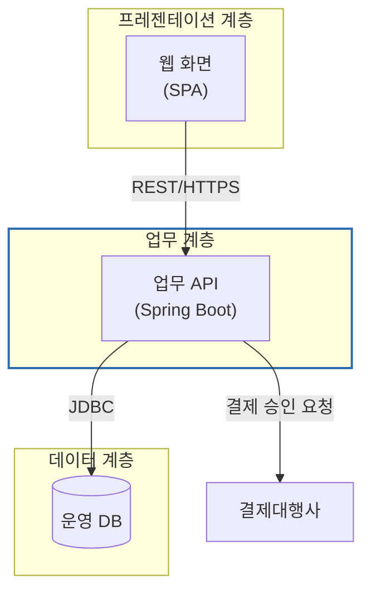

# 다이어그램 스타일 가이드

자동 생성 그림과 직접 작성하는 Mermaid(아키텍처·구성도) 모두 같은 원칙을 따른다.
원칙은 "장식가가 아니라 그 결정을 안고 살아갈 엔지니어처럼 그린다"이다.

## 원칙

1. **이름이 아니라 메커니즘을 그린다.** '캐시' 상자 하나보다, 요청이 어디를 거쳐 어떤 저장소 사이를 오가는지가 정보다.
   논지가 걸린 부분(넘는 경계, 추가되는 홉, 이동하는 데이터)만 그리고 나머지는 뺀다.
2. **화살표에는 라벨을 단다.** 라벨 없는 화살표는 "어떻게든 관련 있음"일 뿐이다. `호출(REST)`, `조회`, `매일 02:00 배치`처럼 쓴다.
3. **복잡도는 결정의 무게에 맞춘다.** 한 홉짜리 질문은 상자 셋이면 된다. 전체 시스템 목록을 늘어놓지 않는다.
   노드가 15개를 넘으면 그림을 나눈다.
4. **색은 의미 하나에만.** 기본은 흰 바탕·회색 테두리(#4a5568). 강조색(#2b6cb0)은 초점 요소 하나(이 서브시스템의 경계,
   지금 설명하는 컴포넌트, 루트 메뉴)에만 쓴다. 같은 표기가 반복될 때만 범례를 둔다.
5. **방향:** 흐름은 좌→우(`flowchart LR`), 계층·레이어·트리는 위→아래(`flowchart TB`/`TD`).
6. **글자는 짧게.** 노드 라벨은 한두 단어 + ID. 설명 문장은 그림이 아니라 본문·캡션에 쓴다.
7. **한 그림, 한 주장.** 문서의 캡션 `[그림] <ID> <이름>`이 그 그림이 보여주는 것을 말한다.

## 직접 쓰는 Mermaid (아키텍처·구성도·전환 절차)

- 테마(폰트·색)는 렌더러가 입힌다. `%%{init}%%`나 색 지정은 초점 요소 `style` 한 줄 외에는 넣지 않는다.
- 제품명·서버 사양·IP 등 입력에 없는 사실은 그림에도 쓰지 않는다(일반 명칭 사용: "운영 DB", "WAS").
- 문법 오류가 나면 `swd diagrams` 결과의 오류 메시지와 `.work/diagrams/.../*.mmd` 원본을 보고 고친다.
  라벨에 괄호·콜론·특수문자가 있으면 `"따옴표"`로 감싼다.
